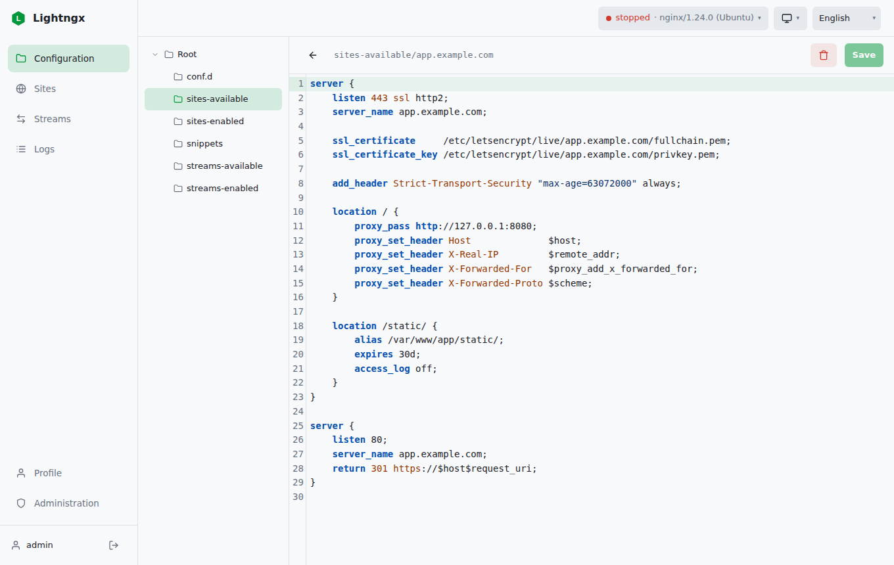
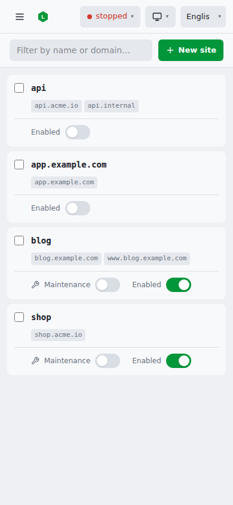

# 🌱 Lightngx

A lightweight web UI for managing nginx.

Edit configuration with syntax highlighting, enable and disable sites, put them
in maintenance, tail logs live, and reload or restart. It is a single static Go
binary with the React frontend embedded: no database server, no runtime
dependency. Run it as one container, or drop the binary next to your nginx.

<p>
  
  
</p>

## Documentation

Full guides live at **https://buco7854.github.io/lightngx/**

- [Getting started](https://buco7854.github.io/lightngx/getting-started)
- [Configuration](https://buco7854.github.io/lightngx/configuration)
- [Accounts, roles and MFA](https://buco7854.github.io/lightngx/accounts)
- [Security](https://buco7854.github.io/lightngx/security)
- [Light and full images](https://buco7854.github.io/lightngx/images)

## Quick start

```sh
mkdir -p nginx/conf nginx/logs lightngx
cp .env.example .env          # optional, every value has a default
docker compose up -d
```

Open the UI on **port 9000**. On the first run it shows a setup page to create
the first administrator.

## Highlights

- **Guarded editor.** Every write, rename, delete and toggle runs `nginx -t`
  first and rolls back if it fails. You cannot break the running config.
- **Sites and streams.** Manage the Debian `sites-available` layout with bulk
  enable, disable, maintenance and delete.
- **Live logs.** Follow over SSE, page through rotated history, filter and color
  warnings.
- **nginx control.** Test, reload and restart. In the container the binary
  supervises nginx, so the UI stays up to fix a broken config.
- **Accounts and MFA.** Local users with roles, TOTP and WebAuthn, and optional
  OIDC. API keys for automation.
- **Themes and languages.** Dark, light and system. English and French.

## Two images

| Tag | Contents |
| --- | --- |
| `ghcr.io/buco7854/lightngx:latest` (`:light`) | nginx plus the lightngx binary |
| `ghcr.io/buco7854/lightngx:full` | light plus the CrowdSec bouncer, nginx-module-vts, and the lua runtime for auth gates |

See [Light and full images](https://buco7854.github.io/lightngx/images) for
what turns on the extras.

## Development

```sh
cd web/app && npm ci && npm run build   # frontend -> web/dist (embedded)
go build ./cmd/lightngx                 # single binary
go test ./...
```

The docs site is a Docusaurus project under `website/`. See the
[development guide](https://buco7854.github.io/lightngx/development).
